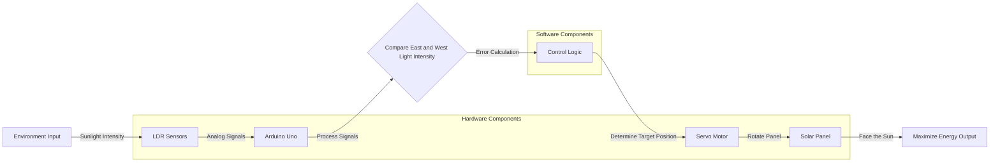

```mermaid
graph LR
    A[Environment Input] -->|Sunlight Intensity| B[LDR Sensors]
    B -->|Analog Signals| C[Arduino Uno]
    C -->|Process Signals| D{Compare East and West Light Intensity}
    D -->|Error Calculation| E[Control Logic]
    E -->|Determine Target Position| F[Servo Motor]
    F -->|Rotate Panel| G[Solar Panel]
    G -->|Face the Sun| H[Maximize Energy Output]
    
    subgraph Hardware Components
        B
        C
        F
        G
    end

    subgraph Software Components
        E
    end

```
