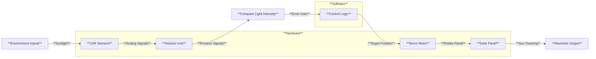

```mermaid
graph LR
    A[**Environment Inputs**] -->|**Sunlight**| B[**LDR Sensors**]
    B -->|**Analog Signals**| C[**Arduino Uno**]
    C -->|**Process Signals**| D[**Compare Light Intensity**]
    D -->|**Error Calc**| E[**Control Logic**]
    E -->|**Target Position**| F[**Servo Motor**]
    F -->|**Rotate Panel**| G[**Solar Panel**]
    G -->|**Sun Tracking**| H[**Maximize Output**]

    subgraph **Hardware**
        B
        C
        F
        G
    end

    subgraph **Software**
        E
    end

```
